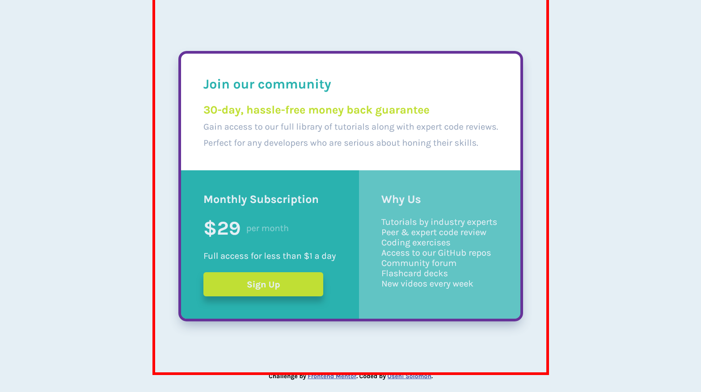

# Frontend Mentor - Single price grid component solution

This is a solution to the [Single price grid component challenge on Frontend Mentor](https://www.frontendmentor.io/challenges/single-price-grid-component-5ce41129d0ff452fec5abbbc). Frontend Mentor challenges help you improve your coding skills by building realistic projects. 

## Table of contents

- [Overview](#overview)
  - [The challenge](#the-challenge)
  - [Screenshot](#screenshot)
  - [Links](#links)
- [My process](#my-process)
  - [Built with](#built-with)
  - [What I learned](#what-i-learned)
  - [Useful resources](#useful-resources)
- [Author](#author)

**Note: Delete this note and update the table of contents based on what sections you keep.**

## Overview

### The challenge

Users should be able to:

- View the optimal layout for the component depending on their device's screen size
- See a hover state on desktop for the Sign Up call-to-action

### Screenshot


### Links

- Solution URL: [solution URL](https://github.com/SoloLere/price-grid.git)
- Live Site URL: [live site URL](https://sololere.github.io/price-grid/)

## My process

### Built with

- Semantic HTML5 markup
- CSS custom properties
- SASS
- Flexbox
- CSS Grid
- Mobile-first workflow

### What I learned

> I discovered that I could not add border radius property on my container. Reason being that it was a standalone grid component to help me center my price grid.
but using an extra div solved the challenge for me.

> when adding border radius to parent, ensure you set overflow to hidden to prevent overflowing children from showing.



```scss
.container {
  margin-inline: auto;
  padding-block: 3rem;
  width: calc(min(90vw, 70rem));
  min-height: 90vh;
  display: grid;
  justify-content: center;
  align-content: center;
  outline: 2px solid red;
}

.price_grid {
  box-shadow:  0 1rem 2rem rgba($color-gray-blue, 0.9);
  border-radius: 1rem;
  overflow: hidden;
  outline: 2px solid rebeccapurple;
}
```


> changing variable value based on media query in SASS
```scss
:root {
  --padding: #{$padding_small};
  
  @media screen and (min-width: $bp-large) {
    --padding: #{$padding_large};
  }
}
```


### Useful resources

- [resource 1](https://stackoverflow.com/questions/48372006/changing-variable-value-based-on-media-query) - This helped me understand how changing variable value based on media query works. I really liked this pattern and will use it going forward.

- [resource 2](https://www.youtube.com/watch?v=DGYMErzcflw) - This is an amazing solution to the chalenge which helped me finally understand my sticking point. I'd recommend it to anyone still trying the challenge.


## Author

- Mail - [Oseni Solomon](jnrolalere@gmail.com)
- Frontend Mentor - [@myusername](https://www.frontendmentor.io/profile/@SoloLere)
